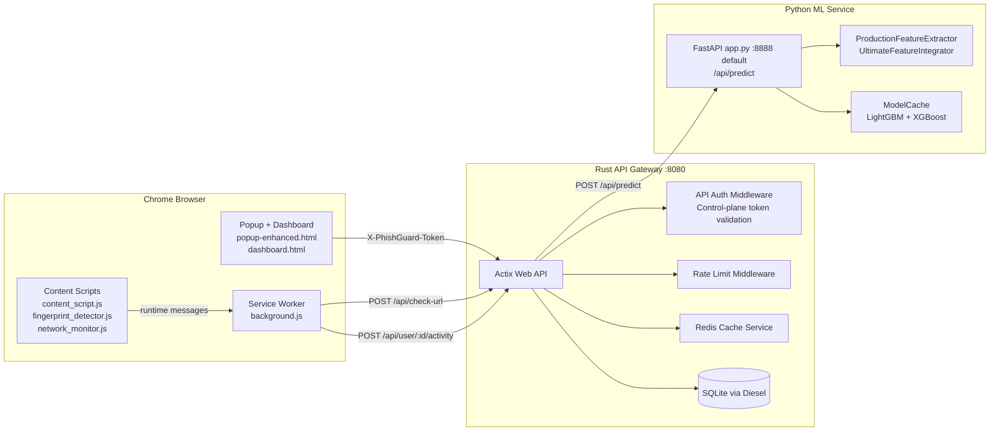
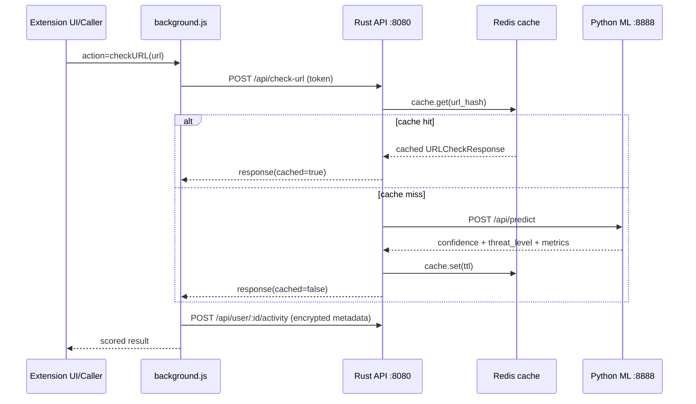
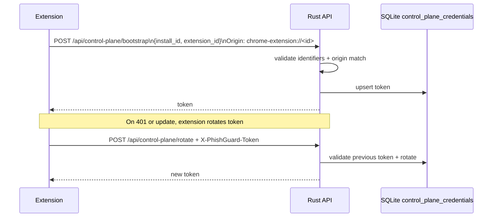
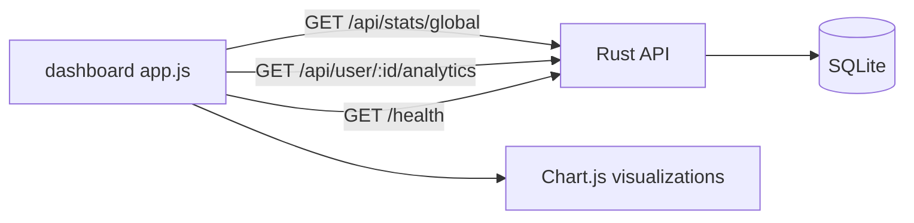
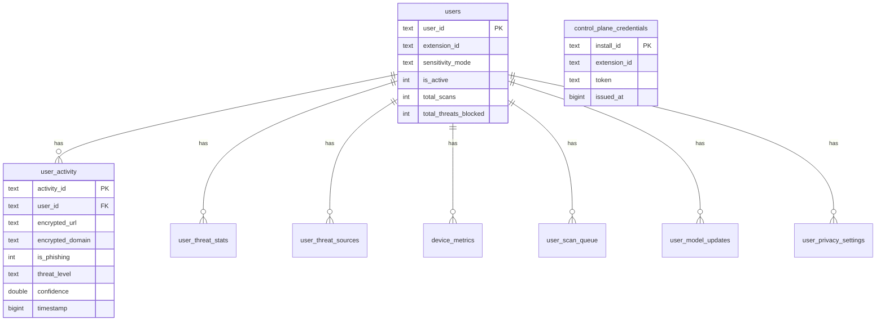

# PhishGuard AI

Production-grade phishing defense platform built as a Chrome Extension + Rust API Gateway + Python ML Inference Service.

This repository is the DP2 workspace for the Intellithon 2025 project and includes:

- Browser-side real-time threat monitoring
- Backend token-gated API and analytics persistence
- ML inference with ensemble models and engineered features
- Operator dashboard and test harness payloads

---

## Table of Contents

1. [Project Overview](#project-overview)
2. [What This System Detects](#what-this-system-detects)
3. [High-Level Architecture](#high-level-architecture)
4. [Component Deep Dive](#component-deep-dive)
5. [Data and Control Flows](#data-and-control-flows)
6. [API Contracts](#api-contracts)
7. [Database and Analytics Model](#database-and-analytics-model)
8. [Machine Learning Pipeline](#machine-learning-pipeline)
9. [Repository Structure](#repository-structure)
10. [Local Development Runbook](#local-development-runbook)
11. [Testing and Validation](#testing-and-validation)
12. [Security and Privacy Notes](#security-and-privacy-notes)
13. [Performance Notes](#performance-notes)
14. [Known Gaps and Technical Debt](#known-gaps-and-technical-debt)
15. [Troubleshooting Guide](#troubleshooting-guide)
16. [Operational Scripts and Patch Utilities](#operational-scripts-and-patch-utilities)
17. [Contribution Guidelines](#contribution-guidelines)
18. [License](#license)

---

## Project Overview

PhishGuard AI is an end-to-end phishing detection system with three cooperating layers:

- **Extension Layer (Chrome Manifest V3)**
  - Injects real-time client-side detectors into pages
  - Monitors network behavior, fingerprinting, and suspicious DOM/UX patterns
  - Surfaces in-page warnings and tracks telemetry
- **Gateway Layer (Rust, Actix-Web)**
  - Serves as a local API facade for extension clients
  - Enforces local API token auth (control plane bootstrap + rotation)
  - Routes URL scoring requests to the Python ML service
  - Persists user analytics and threat events to SQLite
- **ML Layer (Python, FastAPI)**
  - Performs URL feature extraction and model inference
  - Supports sensitivity-aware classification thresholds
  - Returns detailed confidence and timing metrics

The system is designed for low-latency local operation and transparent risk visibility in the dashboard.

---

## What This System Detects

### Extension-side detection domains

1. **Behavioral and UX phishing patterns**
   - Immediate password prompts
   - Cross-origin credential form posts
   - Auto-submit forms
   - Redirect bursts
   - Clipboard abuse

2. **Visual/DOM spoofing patterns**
   - Brand spoofing on non-official domains
   - Hollow credential-harvesting DOM structures
   - Clickjacking overlays

3. **Cryptographic/evasion indicators**
   - Homograph/punycode-like URL patterns
   - Inline-script obfuscation bombs

4. **Network and protocol abuse**
   - C2-like URL/IP/port patterns
   - Excessive exfiltration-size POSTs
   - Suspicious WebSocket and DoH-like traffic indicators

5. **Fingerprinting behavior**
   - Canvas/WebGL probing
   - Audio context abuse
   - Font enumeration patterns
   - High navigator/storage probing density

### Backend/ML detection domains

- URL classification using model ensemble confidence
- Sensitivity-mode thresholds (`conservative`, `balanced`, `aggressive`)
- Persistent analytics aggregation per user and globally

---

## High-Level Architecture



---

## Component Deep Dive

## Extension Surface

### Manifest and permissions

**Source:** `manifest.json`

- Manifest V3 service worker architecture
- Content scripts injected on `<all_urls>` at `document_start`
- Key permissions:
  - `tabs`, `activeTab`
  - `storage`
  - `webRequest`
  - `notifications`

### Core extension modules

| File                      | Role                                          | Key behaviors                                                                                          |
| ------------------------- | --------------------------------------------- | ------------------------------------------------------------------------------------------------------ |
| `background.js`           | Service worker control plane                  | Token bootstrap/rotation, ML request orchestration, analytics logging, blacklist/state persistence     |
| `content_script.js`       | Behavioral/DOM detectors + in-page warning UI | Form/redirect/password heuristics, visual/NLP/homograph/obfuscation scans, Safety Abort overlay action |
| `fingerprint_detector.js` | Browser fingerprinting detector               | Hooks canvas, WebGL, Audio, font checks, storage/nav probing                                           |
| `network_monitor.js`      | Network abuse detector                        | Detects suspicious patterns, exfiltration-size uploads, C2 indicators                                  |
| `popup-enhanced.js`       | Popup telemetry panel                         | Lightweight status and recent activity feed                                                            |
| `app.js`                  | Full dashboard logic                          | Metrics fetching, chart rendering, history filters, settings persistence                               |

### Dashboard UX pages

- `dashboard.html`: Multi-page app with Dashboard/History/Analytics/Settings/Help sections
- `popup-enhanced.html`: Compact quick-view status and activity panel

## Rust Gateway

### Main server

**Source:** `backend/src/main.rs`

Startup responsibilities:

1. Load env/config
2. Initialize Redis cache client (optional)
3. Initialize ML HTTP client
4. Initialize optional GeoIP DB (`geodb/GeoLite2-City.mmdb`)
5. Initialize SQLite pool (fallback in-memory mode if unavailable)
6. Ensure control-plane credential table exists
7. Register middleware + routes and bind host/port

### Middleware model

**Source:**

- `backend/src/middleware/api_auth.rs`
- `backend/src/middleware/rate_limit.rs`

Behavior:

- `bootstrap` endpoint is exempt from token checks
- Non-bootstrap `/api/*` requires `X-PhishGuard-Token` (or `token` query fallback)
- Rate limiting is route-bucketed:
  - default: 120 req/min
  - `/api/check-url`: 90 req/min
  - `/api/user/:id/activity` POST: 60 req/min
- Request body max enforced at 64KB

### Control-plane credential lifecycle

**Source:** `backend/src/handlers/control_plane.rs`

- Bootstrap and rotate require:
  - valid `install_id` and `extension_id` format
  - strict `Origin == chrome-extension://<extension_id>`
- Rotations require valid existing token

## Python ML service

### Service behavior

**Source:** `ml-service/app.py`

- Startup loads `ModelCache()` and `ProductionFeatureExtractor()`
- Prediction endpoint: `POST /api/predict`
- Health endpoint: `GET /health`
- Sensitivity thresholds are dynamic:
  - conservative: `0.80`
  - balanced: `0.50`
  - aggressive: `0.30`

### Important runtime note

`app.py` prints docs/health URLs as `:8000`, but the direct script runner currently binds **port 8888** via:

```python
uvicorn.run("app:app", host="0.0.0.0", port=8888, ...)
```

The backend `.env` currently aligns to this by setting:

`ML_SERVICE_URL=http://127.0.0.1:8888`

---

## Data and Control Flows

### 1) URL scoring flow



### 2) Control-plane token flow



### 3) Dashboard data flow



Current implementation uses polling (2 seconds) for active dashboard/history/analytics views.

---

## API Contracts

## Public endpoints

| Endpoint                       | Method | Auth | Source                                  | Purpose                  |
| ------------------------------ | ------ | ---- | --------------------------------------- | ------------------------ |
| `/`                            | GET    | No   | `backend/src/handlers/root.rs`          | Basic service metadata   |
| `/health`                      | GET    | No   | `backend/src/handlers/health.rs`        | Redis/ML health snapshot |
| `/api/control-plane/bootstrap` | POST   | No   | `backend/src/handlers/control_plane.rs` | First token issuance     |

## Token-protected endpoints

| Endpoint                           | Method | Auth | Source              | Purpose                                 |
| ---------------------------------- | ------ | ---- | ------------------- | --------------------------------------- |
| `/api/control-plane/rotate`        | POST   | Yes  | `control_plane.rs`  | Rotate extension token                  |
| `/api/check-url`                   | POST   | Yes  | `url_check.rs`      | URL phishing scoring                    |
| `/api/stats`                       | GET    | Yes  | `stats.rs`          | Cache stats (currently minimal)         |
| `/api/stats/global`                | GET    | Yes  | `global_stats.rs`   | Global aggregate metrics                |
| `/api/stats/user/{user_id}`        | GET    | Yes  | `global_stats.rs`   | Per-user stats                          |
| `/api/user/{user_id}/analytics`    | GET    | Yes  | `user_analytics.rs` | User recent activity + threat breakdown |
| `/api/user/{user_id}/activity`     | POST   | Yes  | `user_analytics.rs` | Append new threat/activity event        |
| `/api/user/{user_id}/threats/live` | GET    | Yes  | `user_analytics.rs` | SSE live threats stream                 |

### Example: bootstrap token

```bash
curl -X POST "http://localhost:8080/api/control-plane/bootstrap" \
  -H "Content-Type: application/json" \
  -H "Origin: chrome-extension://aaaaaaaaaaaaaaaaaaaaaaaaaaaaaaaa" \
  -d '{"install_id":"install_12345678","extension_id":"aaaaaaaaaaaaaaaaaaaaaaaaaaaaaaaa"}'
```

### Example: URL scoring

```bash
curl -X POST "http://localhost:8080/api/check-url" \
  -H "Content-Type: application/json" \
  -H "X-PhishGuard-Token: <token>" \
  -d '{"url":"https://example.com","sensitivity_mode":"balanced"}'
```

---

## Database and Analytics Model

## Runtime DB engine

Current runtime is SQLite via Diesel (`backend/src/db/connection.rs`), defaulting to `phishguard.db` when `DATABASE_URL` is absent.

## Core tables in active Diesel schema

**Source:** `backend/src/db/schema.rs`

- `users`
- `user_activity`
- `device_metrics`
- `user_threat_stats`
- `user_threat_sources`
- `user_scan_queue`
- `user_model_updates`
- `user_privacy_settings`

Control-plane persistence table is ensured separately by service startup:

- `control_plane_credentials` via `backend/src/services/control_plane_store.rs`

## ER snapshot (key tables)



## Migration files present

- PostgreSQL-style migration: `backend/migrations/.../up.sql`
- SQLite migrations/scripts:
  - `backend/migrations/.../up_sqlite.sql`
  - `backend/migrations/.../up_sqlite_complete.sql`

There are legacy Postgres-oriented SQL scripts in root (`database-schema.sql`, `setup_database.sql`) alongside current SQLite runtime support.

---

## Machine Learning Pipeline

## Active inference path

`ml-service/app.py` -> `ml-model/deployment/model_cache.py` + `ml-model/deployment/production_feature_extractor.py`

### Models

- LightGBM (`lightgbm_159features.pkl`)
- XGBoost (`xgboost_159features.pkl`)

### Feature extraction stack (current production extractor)

`ProductionFeatureExtractor` wraps `UltimateFeatureIntegrator`, which combines:

- URL features
- SSL/TLS features
- DNS features
- Content features
- Behavioral features
- Network features

The integrator reports a 159-feature vector in current implementation.

### Prediction output contract (ML service)

`POST /api/predict` returns:

- `is_phishing`
- `confidence`
- `threat_level`
- `sensitivity_mode`
- `threshold_used`
- `details` (feature extraction and model timing)
- `performance_metrics`

---

## Repository Structure

```
DP2/
├── manifest.json
├── background.js
├── content_script.js
├── fingerprint_detector.js
├── network_monitor.js
├── popup-enhanced.html
├── popup-enhanced.js
├── dashboard.html
├── app.js
├── style.css
├── index.html
├── test-payloads/
│   ├── index.html
│   ├── 1_visual_spoof.html
│   ├── 2_nlp_spear_phishing.html
│   ├── 3_clickjack_obfuscation.html
│   └── 4_web3_drainer.html
├── backend/
│   ├── Cargo.toml
│   ├── .env
│   ├── .env.example
│   ├── migrations/
│   └── src/
│       ├── main.rs
│       ├── handlers/
│       ├── middleware/
│       ├── services/
│       ├── db/
│       └── models/
├── ml-model/
│   ├── features/
│   ├── deployment/
│   ├── models/
│   └── requirements.txt
├── ml-service/
│   ├── app.py
│   ├── requirements.txt
│   └── patch/fix utility scripts
└── root patch/fix scripts
```

---

## Local Development Runbook

## Prerequisites

- Chrome/Chromium browser (Manifest V3 support)
- Rust toolchain (stable)
- Python 3.9+
- Optional Redis if you want cache enabled

## 1) Python ML service

```bash
cd ml-service
pip install -r requirements.txt
python app.py
```

Default script path binds to `http://localhost:8888` in current `app.py`.

## 2) Rust API gateway

```bash
cd backend
cargo run
```

Default local bind: `http://localhost:8080`

Current checked-in `backend/.env` points to ML on `127.0.0.1:8888`.

## 3) Load extension in Chrome

1. Open `chrome://extensions`
2. Enable Developer Mode
3. Click **Load unpacked**
4. Select the `DP2` directory

## 4) Run local payload server (for test pages)

```bash
cd DP2
python -m http.server 8081
```

Then open:

- `http://localhost:8081/` (root test portal)
- `http://localhost:8081/test-payloads/index.html` (payload index)

## 5) Verify health quickly

```bash
curl http://localhost:8080/health
curl http://localhost:8888/health
```

If ML is instead on 8000, update `backend/.env` accordingly:

```env
ML_SERVICE_URL=http://127.0.0.1:8000
```

---

## Testing and Validation

## Payloads

| Payload                             | File                                         | Intent                                |
| ----------------------------------- | -------------------------------------------- | ------------------------------------- |
| Visual spoofing                     | `test-payloads/1_visual_spoof.html`          | Brand impersonation + credential lure |
| NLP spear phishing                  | `test-payloads/2_nlp_spear_phishing.html`    | Urgency + financial language trigger  |
| Clickjacking + obfuscation          | `test-payloads/3_clickjack_obfuscation.html` | Overlay + eval-heavy script trigger   |
| Web3 drainer (legacy test artifact) | `test-payloads/4_web3_drainer.html`          | Legacy wallet-drain simulation page   |

## Dashboard and popup validation

- Open extension popup to confirm status and recent events
- Open `dashboard.html` to validate:
  - global stats
  - history table
  - chart rendering
  - service status indicators

---

## Security and Privacy Notes

## Positive controls in current code

- Control-plane token gating for `/api/*` routes
- Origin-bound bootstrap for extension identity check
- AES-GCM encrypted URL payload logging from extension before analytics write
- Optional GeoIP enrichment gate (`ALLOW_CLIENT_IP_ANALYTICS`)
- Payload size limits and per-route rate limiting middleware

## Design intent

- Keep sensitive browsing details encrypted in analytics path
- Favor local-first operation
- Limit API surface by requiring locally bootstrapped token

---

## Performance Notes

Runtime behavior and performance are shaped by:

- Redis cache hit path in Rust gateway (`cache.rs`)
- ML inference timeout settings (`ml_client.rs`)
- feature extraction overhead in Python (`production_feature_extractor.py`)
- dashboard polling frequency (`app.js` currently every 2 seconds)

Source-level metrics snapshot (excluding build artifacts):

- Total lines (`.js`, `.py`, `.rs`, `.html`, `.css`, `.sql`, `.md`): **23,454**
- File counts:
  - JavaScript: 31
  - Python: 21
  - Rust: 26
  - HTML: 8
  - CSS: 2
  - SQL: 6
  - Markdown: 4

---

## Known Gaps and Technical Debt

This section is intentionally explicit to keep maintainers and reviewers aligned with current code reality.

1. **ML port mismatch risk**
   - `ml-service/app.py` script mode binds to `8888`
   - printed startup text still references `8000`
   - `.env.example` also references `8000`

2. **Dashboard update method**
   - Dashboard currently uses polling every 2 seconds (`app.js`)
   - SSE endpoint exists (`/api/user/:id/threats/live`) but is not currently wired into dashboard code

3. **Action routing mismatch from `content_script.js`**
   - content script reports actions such as `suspiciousActivity`, `statusReport`, `popupAttempt`, `visibilityChange`
   - background message switch does not currently implement dedicated handlers for those action names

4. **Legacy Web3 remnants**
   - Active Web3 interceptor engine was removed from the runtime phase block
   - Legacy constants/artifacts remain in warning maps and test payload files

5. **Patch utility script drift**
   - Multiple `patch_*.js`/`fix_*.js` scripts were one-off repair tools
   - Some contain hardcoded paths from prior workspace layout and are not production runtime code

6. **Stats endpoint limitations**
   - `/api/stats` currently reports cache stats with placeholder behavior in `cache.get_stats()`

7. **SQL/documentation divergence**
   - Root SQL files include older PostgreSQL-focused setup patterns
   - Runtime backend currently defaults to SQLite unless overridden

---

## Troubleshooting Guide

## Symptom: Dashboard shows backend offline

Check:

1. Rust server running on `:8080`
2. Browser can reach `GET /health`
3. Control-plane token present in extension storage

## Symptom: Backend healthy but ML unavailable

Likely ML port mismatch.

Verify:

- `backend/.env` -> `ML_SERVICE_URL`
- actual ML bind port from `app.py` or uvicorn command

## Symptom: 401 Unauthorized local API access

Control-plane token invalid or absent.

Resolution:

1. reload extension
2. allow bootstrap to run from extension origin
3. ensure `Origin` rules in backend are satisfied

## Symptom: no analytics movement

Check:

- tokened calls from popup/dashboard are succeeding
- writes to `/api/user/:id/activity` are returning 200
- SQLite database file is writable and schema present

## Symptom: Safety Abort button not closing tab

Current implementation sends `closeCurrentTab` to background and attempts `window.close()` in content script.

Verify:

- extension reloaded after latest background/content updates
- `tabs` permission still present in manifest

---

## Operational Scripts and Patch Utilities

Repository includes many patch/fix scripts from iterative development and debugging sessions.

Examples:

- `patch_dashboard_interval.js`
- `patch_bg_close_tab.js`
- `patch_web3.js`
- `fix_safety_abort.js`
- `remove_web3*.js`
- `ml-service/patch_*.js` and `ml-service/fix_*.js`

Guidance:

- Treat them as maintenance utilities, not core runtime dependencies
- Review script internals before executing in a different environment

---

## Contribution Guidelines

## Branch and commit conventions

- Prefer small focused commits
- Keep runtime changes separate from docs-only changes
- Include reproducible validation steps in PR description

## Recommended quality checks

### Rust

```bash
cd backend
cargo fmt
cargo clippy -- -D warnings
cargo test
```

### Python

```bash
cd ml-service
python -m pip install -r requirements.txt
python -m py_compile app.py
```

### Extension smoke

1. Reload extension in `chrome://extensions`
2. Open popup and dashboard
3. Validate `/health`, `/api/stats/global`, `/api/user/:id/analytics` all respond

---

## License

MIT License.

Project author: Sri Vishnu
---2523
