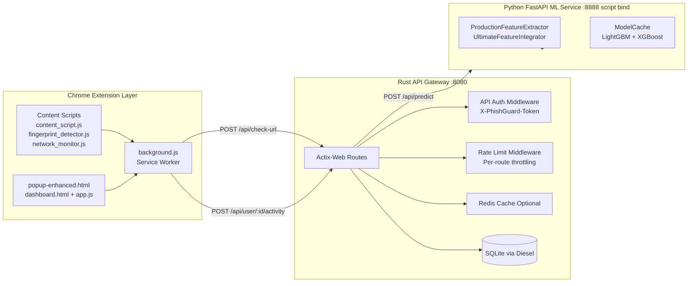

## 1. INTRODUCTION

### 1.1 Overview
PhishGuard AI is a multi-layer phishing detection and prevention platform developed as a Chrome Extension (Manifest V3), a Rust-based API gateway, and a Python FastAPI ML inference service. The project is designed for local-first operation, where browser activity is evaluated in real time through both rule-based behavior analysis and machine learning prediction. The system combines network threat detection, visual spoofing detection, cryptographic anomaly checks, and feature-based URL classification to reduce phishing risk during browsing.

At a high level, the extension captures runtime browser signals, the Rust gateway provides authenticated and rate-limited API orchestration, and the ML service computes phishing confidence based on a 159-feature pipeline. The dashboard and popup provide operational visibility, threat trends, and configuration controls such as sensitivity mode.

### 1.2 Abstract
Phishing attacks increasingly use multi-step deception strategies, including fake login interfaces, urgent social-engineering text, obfuscated scripts, and credential exfiltration flows. Traditional blacklist-only defenses are often reactive and insufficient for newly generated or short-lived malicious domains. PhishGuard AI addresses this challenge through a layered architecture that combines in-browser detection heuristics with machine-learning-based risk scoring.

The implemented solution performs continuous monitoring through content scripts, sends token-authenticated requests to a local API gateway, and invokes a feature-rich ML inference engine for phishing probability estimation. The backend stores user analytics and threat activity in SQLite and supports global/user-level security metrics. The platform offers configurable detection sensitivity, a modern dashboard for threat intelligence visibility, and structured API contracts to support further hardening.

### 1.3 Motivation for the project
The motivation behind this project includes the following practical needs:

1. The rise of convincing phishing pages that imitate trusted brands and bypass naive filters.
2. The requirement for real-time defense at the browser edge, where users interact with malicious content.
3. The need for privacy-conscious operation, minimizing unnecessary external data exposure.
4. The need for a complete engineering system (detection, decisioning, analytics, and UX), not only a model demo.
5. The need to integrate software engineering, cybersecurity, and ML in one deployable architecture.

This project was therefore designed not just to classify URLs, but to create an end-to-end protective workflow from detection to visualization and response.

### 1.4 Problem Definition and Scenarios
The core problem is to detect and mitigate phishing attempts in live browsing sessions before user credentials or sensitive information are compromised.

Representative threat scenarios covered by this project:

1. Brand spoofing pages on non-official domains that mimic payment or banking portals.
2. Immediate password prompts and suspicious credential forms that submit to cross-origin targets.
3. Social-engineering urgency pages that pressure users into unsafe actions.
4. Obfuscated JavaScript payloads attempting to hide malicious behavior.
5. Homograph and punycode-like URL tricks designed to visually deceive users.
6. Excessive data-upload patterns and command-and-control style network behavior.
7. Browser fingerprinting abuse through Canvas/WebGL/Audio/font probing.

The project aims to detect these patterns with low latency and provide actionable outputs: confidence score, threat level, and user-safe UI warnings.

### 1.5 Summary
PhishGuard AI introduces a practical, layered anti-phishing approach with strong local integration across browser, backend, and ML components. The project demonstrates how rule-based runtime intelligence and model-driven prediction can be unified into one security product pipeline suitable for iterative hardening toward production readiness.

## 2. LITERATURE REVIEW

### 2.1 Introduction
Phishing detection research has evolved from static blacklist matching toward dynamic behavior analysis and machine learning. Current anti-phishing strategies generally fall into four categories:

1. Signature and reputation-based filtering.
2. URL lexical and structural analysis.
3. Content and behavioral analysis of webpages.
4. Ensemble and hybrid ML systems with adaptive thresholds.

The most effective modern systems combine these methods rather than relying on any single signal.

### 2.2 Literature review
Conventional blacklist methods are lightweight and fast but suffer from delayed coverage for newly registered or fast-rotating malicious domains. URL-only models improve zero-day detection but can miss context-aware social engineering. Content analysis (DOM structure, form behavior, suspicious script patterns) increases contextual reliability but can be costlier in runtime. Network-based indicators (C2-like endpoints, abnormal uploads, suspicious protocol usage) offer another defensive layer, especially against multi-stage attacks.

Recent studies and industrial tools also emphasize:

1. Ensemble learning for robustness over single classifiers.
2. Feature diversity (URL, SSL, DNS, content, behavior, network) for generalization.
3. User-adaptive thresholds to balance false positives and misses.
4. Explainability and telemetry for operational trust.

PhishGuard AI follows this hybrid direction by combining extension-side behavioral engines with backend ML inference. Its architecture aligns with contemporary literature by integrating multi-domain features and layered detection, while exposing confidence-oriented outputs for informed user action.

## 3. PROJECT DESCRIPTION

### 3.1 Objective of the Design Project work
The primary objective is to build an integrated phishing defense system that:

1. Detects suspicious URLs and page behaviors in real time.
2. Produces confidence-based phishing decisions using ML.
3. Maintains authenticated local communication between extension and backend.
4. Persists analytics for dashboard reporting and trend analysis.
5. Supports configurable user sensitivity levels for risk control.

The objective is both technical and product-oriented: secure detection plus usable visibility.

### 3.2 Existing System
In practice, many existing protection flows are limited to one or two of the following:

1. Static blacklists and known-domain blocking.
2. Browser warning pages based on pre-indexed reputation.
3. Server-side URL scans without client-side behavior context.

These approaches can miss advanced phishing attempts using fresh infrastructure, visual deception, or staged interaction triggers. They also often provide limited transparency into why a threat was flagged.

### 3.3 Proposed System
The proposed system in this project is a three-tier architecture:

1. Extension Layer:
    Real-time monitoring through content_script.js, fingerprint_detector.js, and network_monitor.js with in-page warning overlays.
2. Rust Gateway Layer:
    Token-based local API enforcement, route-level middleware, Redis-assisted caching, and SQLite analytics persistence.
3. ML Layer:
    FastAPI inference using ProductionFeatureExtractor and ModelCache for 159-feature phishing classification with sensitivity thresholds.

Functional flow:

1. Browser event and URL context are captured by extension logic.
2. The background service worker requests URL scoring through authenticated API calls.
3. The gateway serves cache hits or forwards to ML for prediction.
4. Results are logged as user activity and reflected in dashboard analytics.

### 3.4 Benefits of Proposed System
Key benefits of this design:

1. Multi-layered defense reduces single-point blind spots.
2. Local-first operation improves privacy posture and development control.
3. Dynamic sensitivity modes allow user-specific risk tolerance.
4. Dashboard analytics improve observability and incident understanding.
5. Token-gated API flow reduces unauthorized local API misuse.
6. Replay-window and nonce checks strengthen analytics ingestion safety.

Overall, the proposed system is significantly more complete than isolated URL filters because it unifies detection, response, and reporting.

## 4. SYSTEM DESIGN

### 4.1 Architecture Diagram

Design interpretation:

1. Browser layer captures and reports suspicious behaviors.
2. Rust gateway centralizes authentication, validation, rate limiting, caching, and persistence.
3. ML service performs feature extraction and prediction when cache miss occurs.
4. Results are returned to extension and visualized through popup/dashboard interfaces.

## 5. PROJECT REQUIREMENTS

### 5.1 Hardware and Software Specification

Hardware requirements (recommended for smooth local operation):

1. CPU: Minimum dual-core (quad-core preferred for parallel feature extraction).
2. RAM: Minimum 4 GB (8 GB recommended for simultaneous browser, Rust, and Python processes).
3. Storage: At least 2 GB free for dependencies, cache, and analytics DB growth.
4. Network: Localhost access for inter-service communication.

Software requirements:

1. OS: Windows 10/11, Linux, or macOS.
2. Browser: Chrome 96+ (Manifest V3 support).
3. Rust toolchain: rustc/cargo (project uses edition 2021, Actix-web stack).
4. Python: 3.8+ (3.9+ preferred for package compatibility).
5. Backend dependencies: Actix-web, Diesel (SQLite), Redis client, reqwest, crypto crates.
6. ML dependencies: FastAPI, Uvicorn, NumPy, scikit-learn, LightGBM, XGBoost, feature libraries.
7. Optional Redis: For cache acceleration; system can run in cache-disabled mode if unavailable.
8. SQLite: Used as runtime analytics store.

Operational ports in current codebase:

1. Backend API: 8080.
2. ML service: Script binding currently 8888 (startup print text still references 8000).
3. Redis: 6379 (optional).

### 5.2 Summary
The project can be executed on a typical student/developer machine without cloud infrastructure. Its dependency profile is moderate, and the architecture is suitable for local demonstration, testing, and iterative enhancement.

## 6. MODULE DESCRIPTION

### 6.1 Modules
Major modules in the implementation:

1. Extension Service Worker Module (background.js).
2. Content Detection Module (content_script.js).
3. Fingerprinting Defense Module (fingerprint_detector.js).
4. Network Threat Module (network_monitor.js).
5. Popup and Dashboard UI Module (popup-enhanced.js, app.js, dashboard.html).
6. Backend API Route Module (handlers in backend/src/handlers).
7. Backend Middleware Module (api_auth.rs, rate_limit.rs).
8. Data Layer Module (Diesel schema/models + SQLite).
9. Control-plane Credential Module (control_plane.rs + control_plane_store.rs).
10. ML Inference Module (ml-service/app.py).
11. Feature Engineering Module (production_feature_extractor.py + ultimate_integrator.py).
12. Model Loading Module (model_cache.py).

### 6.2 Key Modules
Key modules and their responsibilities:

1. background.js:
    Handles control-plane bootstrap/rotation, authenticated API calls, scan orchestration, and analytics logging with encrypted URL payloads.
2. content_script.js:
    Implements behavioral checks such as immediate password prompts, cross-origin form posting, popup abuse, redirect bursts, and advanced anti-evasion heuristics.
3. api_auth.rs:
    Enforces token-gated access for API routes except bootstrap and preflight requests.
4. rate_limit.rs:
    Applies route-aware request budgets and request-size checks.
5. url_check.rs + ml_client.rs:
    Coordinates cache lookup and ML prediction flow.
6. user_analytics.rs:
    Performs input validation, replay protection via nonce/timestamp window, analytics insertion, and SSE streaming for live threat updates.
7. app.py (ML service):
    Validates request input, extracts features, predicts confidence, applies sensitivity threshold, and returns structured response metrics.

### 6.3 User Interface
The user-facing interface has two main surfaces:

1. Popup (popup-enhanced.html + popup-enhanced.js):
    Provides quick status, recent activity, and dashboard entry.
2. Dashboard (dashboard.html + app.js):
    Multi-page control center with Dashboard, History, Analytics, Settings, and Help pages.

UI capabilities include:

1. Live KPI cards for threats blocked, total scans, and model confidence trends.
2. Chart-based visualization using Chart.js.
3. History filters and CSV export.
4. Sensitivity and behavior settings (conservative, balanced, aggressive profiles).
5. Inline troubleshooting/help content.

### 6.4 Technology stack
The stack used in this project:

1. Frontend/Extension:
    JavaScript, HTML5, CSS3, Chrome Extension APIs (Manifest V3), Chart.js.
2. Backend:
    Rust, Actix-web, Diesel ORM, SQLite, optional Redis, reqwest, chrono, serde.
3. ML Service:
    Python, FastAPI, Uvicorn, Pydantic, NumPy, scikit-learn, LightGBM, XGBoost.
4. Feature Pipeline:
    URL, SSL, DNS, content, behavioral, and network feature extractors integrated into a 159-feature vector.

### 6.5 Security Consideration
Security controls currently implemented:

1. Control-plane token lifecycle (bootstrap and rotation).
2. Origin verification for token bootstrap/rotation against extension ID.
3. API authentication middleware for protected routes.
4. Route-specific rate limiting and request size limits.
5. Client-side AES-GCM URL encryption for activity logging.
6. Input validation and nonce-based replay protection in activity logging API.

Important hardening notes for report discussion:

1. CORS allows chrome-extension and localhost origins, which is suitable for local deployment but should be tightened for wider exposure.
2. ML model artifacts must be present for full ML mode; otherwise service startup becomes unhealthy.
3. Environment templates include legacy values (for example database and ML port defaults) that should be normalized.
4. Privacy-sensitive fields such as IP analytics are appropriately gated by environment configuration.

## 7. RESULT ANALYSIS
Result analysis is based on implemented outputs, metrics endpoints, and UI behavior in the current codebase.

Functional outcomes achieved:

1. End-to-end URL scan path from extension to backend to ML and back to UI is implemented.
2. Threat classification returns confidence, threat level, sensitivity mode, threshold used, and latency details.
3. Analytics persistence supports recent activities, per-user threat breakdown, and global aggregate metrics.
4. Dashboard surfaces trend charts and KPI summaries with auto-refresh.
5. SSE live-threat endpoint exists for near-real-time activity streaming.

Measurable indicators available in implementation:

1. confidence (0.0 to 1.0).
2. threat_level (SAFE/LOW/MEDIUM/HIGH/CRITICAL).
3. latency_ms and feature/inference timing data.
4. total_scans, threats_blocked, scans_last_hour, scans_last_24h.
5. threat distribution and top phishing domains.

Observed engineering strengths:

1. Clear layering and responsibility separation.
2. Strong local API contract structure with middleware controls.
3. Rich threat telemetry and visualization pipeline.
4. Inclusion of multiple detection engines beyond pure URL scoring.

Observed limitations and analysis points:

1. Full ML quality depends on availability of trained model artifacts.
2. Port/config mismatch exists in printed ML startup text versus actual bind value.
3. Some documentation and template files still reflect older assumptions.

Therefore, the system demonstrates a strong and functional prototype with production-oriented architecture, while still requiring configuration cleanup and model packaging discipline for robust deployment.

## 8. Summary
This project delivers a comprehensive anti-phishing platform that integrates browser-side behavior intelligence, secure backend orchestration, and machine-learning-based classification. Compared to basic URL filtering systems, PhishGuard AI offers richer detection coverage, stronger runtime observability, and configurable protection behavior.

From a design-project perspective, it successfully demonstrates:

1. Full-stack security system construction.
2. Practical API, middleware, and data-persistence design.
3. Integration of ML inference into a real browser workflow.
4. User-facing analytics and operational control interfaces.

In summary, PhishGuard AI is a technically substantial, end-to-end cybersecurity solution with clear academic and practical value. With model artifact packaging and configuration standardization, it can be advanced from a high-quality prototype toward a hardened deployment.

